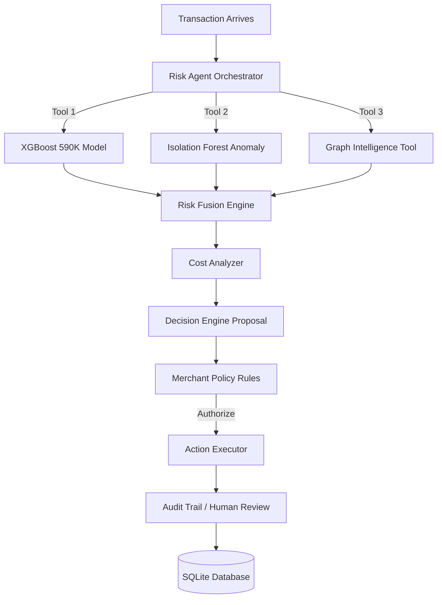

# RazorShield
**An Autonomous AI Risk Manager for Merchants**

Traditional fraud systems stop at prediction. RazorShield closes the loop.

RazorShield is a production-oriented prototype that detects risk, investigates evidence, reasons across behavioral anomalies and transaction networks, estimates intervention costs, chooses a bounded response, escalates to a human when uncertain, executes the authorized action, and records the entire investigation in an immutable audit trail.

## Features
- **AI Agent Orchestrator:** Drives the investigation using a dynamic state machine.
- **Typed Evidence Tools:** Integrates XGBoost, Isolation Forest, and Graph Network Intelligence.
- **Cost-Aware Reasoning:** Calculates expected loss vs. intervention friction.
- **Policy Engine:** Enforces hard merchant rules over agent proposals.
- **Risk Command Center:** A beautiful fintech UI built with glassmorphism for investigating agent traces.

## Architecture

## Running the Application
### Local
1. `pip install -r requirements.txt`
2. `pip install fastapi uvicorn pydantic`
3. `python run.py`
4. Open UI: http://localhost:8000/ui/

### Docker
1. `docker build -t razorshield .`
2. `docker run -p 8000:8000 razorshield`

## ML Metrics (Hold-out Test 88K samples)
- **XGBoost ROC-AUC:** ~0.9017
- **Fusion ROC-AUC:** 0.8972 (Weighted ensemble)

*This is an experimental prototype built for the Razorpay AI Buildathon.*