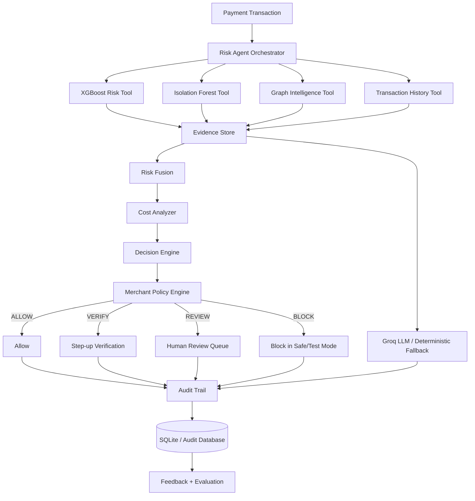

# 🛡️ RazorShield AI Risk Manager

<div align="center">

### Autonomous, Explainable, Cost-Aware AI Risk Management for Digital Payments

**RazorShield is an agentic payment-risk platform that goes beyond fraud prediction.** It combines supervised ML, behavioral anomaly detection, transaction-network intelligence, cost-aware decisioning, deterministic policy guardrails, human review, auditability, and GenAI-assisted risk synthesis into one investigation workflow.

**Built for the Razorpay AI Buildathon — AI Risk Manager track.**

</div>

---

## 🚀 The Vision

Traditional fraud systems often stop at:

```text
Transaction → Model → Fraud / Not Fraud
```

RazorShield closes the loop:

```text
Transaction
     ↓
Risk Agent
     ↓
Investigate
     ↓
┌───────────────┬────────────────┬─────────────────┐
│               │                │
▼               ▼                ▼
XGBoost       Anomaly         Graph Intelligence
│               │                │
└───────────────┴────────────────┘
                 ↓
          Evidence Collection
                 ↓
            Risk Fusion
                 ↓
            Cost Analyzer
                 ↓
          Decision + Policy
                 ↓
      ┌──────────┼──────────┐
      ▼          ▼          ▼
    ALLOW      VERIFY     REVIEW/BLOCK
                 ↓
       Human-in-the-loop
                 ↓
             Audit Trail
```

The goal is not only:

> **"Is this transaction fraudulent?"**

It is:

> **"What is the current risk, what evidence supports it, what action is safest, what will that action cost, and can the decision be explained and audited?"**

---

# 🧠 What Makes RazorShield an AI Agent?

RazorShield is not simply an LLM placed on top of an XGBoost model.

The agent orchestrates specialized tools:

```text
OBSERVE
  ↓
INVESTIGATE
  ↓
COLLECT EVIDENCE
  ↓
REASON
  ↓
PLAN
  ↓
POLICY CHECK
  ↓
ACT
  ↓
VERIFY
  ↓
AUDIT
```

The agent can use:

- **XGBoost Risk Tool** — known fraud-pattern probability
- **Anomaly Tool** — behavioral novelty
- **Graph Tool** — suspicious entity relationships
- **Transaction History Tool** — historical behavior context
- **Cost Analyzer** — expected cost of possible actions
- **Decision Engine** — policy-aware action proposal
- **GenAI Synthesis** — operator-facing explanation and investigation summary

The core financial action is never left to an unrestricted LLM. The system separates **agent recommendation** from **policy authorization**.

---

# 📊 Dataset

RazorShield uses the **IEEE-CIS Fraud Detection** dataset.

## Training data

### `train_transaction.csv`

```text
Rows:    590,540
Columns: 394
```

Transaction-level signals include:

- transaction amount and time
- product category
- card-related attributes
- email-domain information
- address signals
- M/C/D/V-style anonymized features
- transaction behavior and matching signals
- fraud target

### `train_identity.csv`

```text
Rows:    144,233
Columns: 41
```

Identity/context signals include:

- anonymized identity variables
- device type
- device information
- browser/platform-related signals
- identity matching features

The two datasets are joined through:

```text
TransactionID
```

Resulting merged training universe:

```text
≈ 590,540 transactions
≈ 434 columns before additional engineered features
```

Identity coverage is incomplete, so RazorShield explicitly models:

```text
has_identity
```

rather than assuming identity data is always available.

---

# 🎯 Target and Class Imbalance

The target is:

```text
isFraud
```

```text
0 → legitimate
1 → fraud
```

Fraud is a minority class. Therefore, a model that predicts every transaction as legitimate could achieve high accuracy while detecting no fraud at all.

RazorShield therefore emphasizes:

- **Precision**
- **Recall**
- **F1**
- **ROC-AUC**
- **PR-AUC**
- **Confusion Matrix**
- **False-positive / false-negative analysis**
- **Business cost**

---

# 🏗️ End-to-End Architecture



---

# 🔬 ML Pipeline

## 1. Chronological split

The full training dataset is ordered using `TransactionDT` and split chronologically:

```text
70% → Train
15% → Validation
15% → Final Test
```

Approximate sizes:

```text
Train      413,378
Validation  88,581
Test        88,581
```

This avoids randomly mixing future transactions into earlier training periods.

---

## 2. Behavioral Feature Engineering

RazorShield creates features that describe how the transaction behaves, not only what it contains.

### `log_TransactionAmt`

Log-transformed transaction value to reduce extreme skew.

### `TransactionHour`

Hour-of-day behavior.

### `TransactionDay`

Relative transaction-day information.

### `has_identity`

Whether identity context is available.

### `time_since_previous`

Elapsed time from the previous transaction.

### `amount_change`

Difference from the previous transaction amount.

### `abs_amount_change`

Magnitude of amount change regardless of direction.

### `card1_frequency`

Historical transaction frequency for the card identifier.

### `card1_avg_previous_amount`

Historical amount behavior for the card identifier.

### `amount_vs_card_avg`

Current amount relative to the card's historical behavior.

For example:

```text
Historical average ≈ ₹100
Current transaction ≈ ₹2,000

amount_vs_card_avg ≈ 20×
```

### `recent_card_transactions`

Recent activity / transaction velocity signal.

These features give the models:

```text
transaction context
+
behavioral context
```

---

# 🧠 XGBoost — Primary Fraud Model

XGBoost is the primary supervised model because IEEE-CIS is a high-dimensional, mixed-type tabular fraud problem.

It learns nonlinear relationships across:

- transaction features
- identity features
- categorical signals
- behavioral features
- anonymized C/D/V features
- card and email context

## Final held-out test result

| Metric | XGBoost V2 |
|---|---:|
| Accuracy | **0.9676** |
| Precision | **0.5412** |
| Recall | **0.4535** |
| F1 | **0.4935** |
| ROC-AUC | **0.9017** |
| PR-AUC | **0.5152** |

Confusion matrix:

```text
[[84313  1185]
 [ 1685  1398]]
```

Interpretation:

- 84,313 legitimate transactions correctly identified
- 1,185 legitimate transactions incorrectly flagged
- 1,685 fraud transactions missed
- 1,398 fraud transactions detected

The model is strong on ranking quality, but it is not perfect. RazorShield therefore treats the ML score as evidence in a larger risk-management workflow.

---

# 🕵️ Isolation Forest — Behavioral Novelty

The anomaly component answers a different question:

> **"Does this transaction look unusual compared with legitimate behavioral patterns?"**

It is not treated as a replacement for XGBoost.

Current experimental V2 performance:

```text
ROC-AUC ≈ 0.5747
PR-AUC  ≈ 0.0336
```

This is intentionally reported as a secondary signal.

Its value is in **novelty detection** and providing an independent behavioral perspective to the agent.

---

# 🌐 Graph Intelligence

Fraud is often relational.

A transaction can be connected to:

```text
Transaction
   │
   ├── Card
   ├── Device
   ├── Email
   ├── Address
   └── Other identity context
```

Example:

```text
             Device-A
             /      \
         Card-1    Card-2
            |         |
       Transaction  Transaction
             \       /
              Email-X
```

A transaction that looks normal by itself may become suspicious when its surrounding network is examined.

Graph-derived features can include:

- card transaction count
- card-to-device relationships
- card-to-email relationships
- device-to-card count
- shared device count
- shared email count
- shared address count
- network degree
- connected entity count
- historical entity risk
- connected risk fraction

### Leakage rule

Historical graph risk must only use information available before the transaction being scored.

Future test labels must never be used to construct current-time risk features.

---

# ⏱️ LSTM — Experimental Temporal Model

Fraud can also be sequential:

```text
₹50 → ₹60 → ₹55 → ₹70 → ₹65 → ₹7,000
```

An LSTM was therefore evaluated on behavioral transaction sequences.

Current final test result:

| Metric | LSTM |
|---|---:|
| Accuracy | 0.8473 |
| Precision | 0.0518 |
| Recall | 0.1956 |
| F1 | 0.0819 |
| ROC-AUC | **0.5619** |
| PR-AUC | **0.0454** |

The result is substantially weaker than XGBoost. RazorShield therefore **does not force LSTM into the primary production fusion**.

This is deliberate model-selection discipline: a deeper model is not automatically a better model.

---

# 🔀 Risk Fusion

RazorShield combines independent evidence streams:

```text
XGBoost Risk
     +
Anomaly Risk
     +
Graph Risk
     ↓
Risk Fusion
     ↓
Final Risk Score 0–100
```

Fusion weights are configuration-driven and should be selected on validation data rather than repeatedly tuned against the final test set.

A simple baseline currently used for the XGBoost + anomaly experiment is:

```text
XGBoost  = 70%
Anomaly  = 30%
```

Observed fusion ROC-AUC in the current implementation:

```text
≈ 0.8972
```

This is slightly below XGBoost's standalone ROC-AUC (0.9017), so RazorShield does **not** claim that adding every secondary signal automatically improves the model. The graph layer is intended to be evaluated as the next evidence source before the final fusion is locked.

---

# 🤖 Agentic Risk Orchestration

The core product is the **Risk Agent**, not the dashboard and not a single ML model.

The agent receives a transaction and can orchestrate tools such as:

```text
XGBoost Tool
Anomaly Tool
Graph Tool
History Tool
Cost Analyzer
Decision Engine
```

## Example investigation

```text
Transaction arrives
      ↓
XGBoost risk = elevated
      ↓
Agent requests more evidence
      ↓
Anomaly tool
      ↓
Graph tool
      ↓
Transaction history
      ↓
Cost analyzer
      ↓
Decision proposal
      ↓
Policy validation
      ↓
REVIEW
      ↓
Audit
```

The agent should not blindly call every tool for every transaction.

Low-risk cases can terminate early; ambiguous cases trigger deeper investigation.

---

# 🧠 GenAI Synthesis

The current product can use **Groq LLM / Llama 3.3** as a natural-language risk-synthesis layer.

The LLM receives structured evidence from deterministic systems instead of replacing them.

It can:

- summarize evidence
- organize risk factors
- explain a decision
- explain cost trade-offs
- prepare an operator-facing investigation report

It must not:

- invent model evidence
- change thresholds
- override policy
- execute unrestricted financial actions
- make unsupported claims

A deterministic/template fallback is available when the LLM service is unavailable.

Observed application-level GenAI reasoning latency is approximately **800 ms per cycle** in the current demo setup; this is an observed prototype value, not a guaranteed SLA.

---

# 🛡️ Policy Engine and Guardrails

The agent recommends.

The policy engine authorizes.

Example:

```text
AI Agent → ALLOW
       ↓
Merchant Policy
       ↓
Transaction violates review rule
       ↓
OVERRIDE → REVIEW
```

This separation prevents an AI model from becoming an unrestricted financial decision-maker.

---

# 💰 Cost-Aware Decisioning

Fraud risk is not the only variable.

Every intervention has a business cost.

### ALLOW

Potential fraud / chargeback loss.

### VERIFY

Customer friction, verification overhead, possible conversion impact.

### REVIEW

Manual operations cost.

### BLOCK

Potential loss of a legitimate customer or transaction.

RazorShield compares the expected costs of possible actions and selects the lowest-cost safe response subject to merchant policy.

Conceptually:

```text
risk probability
      ×
financial consequence
      ×
intervention cost
      ↓
expected action cost
```

---

# 🎯 Risk Decisions

The default configurable risk bands are:

```text
0–30     LOW       → ALLOW
30–60    MEDIUM    → VERIFY
60–80    HIGH      → REVIEW
80–100   CRITICAL  → BLOCK / REVIEW
```

These are configurable business policies, not universal truths.

---

# 👥 Human-in-the-Loop

High-risk and low-confidence cases can enter a review queue.

Reviewers can:

```text
APPROVE
REJECT
ESCALATE
```

The system records the difference between the original agent recommendation and the final human decision.

That provides a feedback dataset for future offline model and agent evaluation without automatically retraining production models from unvalidated feedback.

---

# 🔍 Explainability

RazorShield provides evidence-based explanations rather than exposing hidden model reasoning.

Example:

```text
Risk Score: 87
Decision: REVIEW

Why?
• XGBoost fraud probability is elevated.
• Transaction amount is far above historical card behavior.
• Recent transaction velocity is unusual.
• Device is connected to multiple cards.
• Network evidence increases concern.
• REVIEW has lower expected cost than ALLOW.
```

---

# 📡 Observability

The Risk Command Center tracks both business risk and system health.

Example operational signals:

- transactions screened
- fraud detections
- review volume
- ALLOW / VERIFY / REVIEW / BLOCK distribution
- false-positive rate
- response latency
- agent confidence
- tool latency
- model version
- human override rate

---

# 🧾 Audit Trail

Every risk investigation should be traceable.

An audit event can include:

```text
Agent Run ID
Transaction ID
Timestamp
Model Version
Feature Version
XGBoost Risk
Anomaly Risk
Graph Risk
Final Risk
Decision
Policy Result
Action
Human Override
Reason
```

This allows an operator to answer:

> **"Why did RazorShield make this decision?"**

---

# 🖥️ Risk Command Center

The product UI is designed as a fintech risk-operations console.

## Overview

- transactions screened
- fraud detected
- review rate
- false-positive rate
- estimated loss prevented
- decision distribution
- system latency

## Transaction Investigation

Show:

```text
Fraud Probability
XGBoost Risk
Anomaly Risk
Graph Risk
Final Risk
Risk Level
Decision
```

## Agent Investigation Trace

```text
✓ Transaction received
✓ XGBoost consulted
✓ History consulted
✓ Anomaly checked
✓ Graph checked
✓ Cost analyzed
✓ Policy checked
✓ Action authorized
✓ Audit created
```

## Graph View

```text
Transaction
   ↕
Card
   ↕
Device
   ↕
Email
   ↕
Address
```

Sensitive identifiers should be masked or hashed in the UI.

## Cost Panel

```text
ALLOW   → expected loss
VERIFY  → friction cost
REVIEW  → operational cost
BLOCK   → potential customer cost
```

---

# 🏛️ Backend Architecture

RazorShield uses a FastAPI service layer that separates:

```text
API Routes
    ↓
Schemas / Validation
    ↓
Risk Agent
    ↓
Model Services
Graph Service
Fusion Service
Cost Service
Decision Engine
Policy Engine
Audit Service
```

Representative endpoints:

```text
GET  /health

POST /api/v1/risk/predict
POST /api/v1/risk/investigate
POST /api/v1/risk/decide
POST /api/v1/risk/execute

GET  /api/v1/risk/{transaction_id}
GET  /api/v1/risk/{transaction_id}/graph
GET  /api/v1/risk/{transaction_id}/explanation

GET  /api/v1/agent/{agent_run_id}/trace
GET  /api/v1/metrics
GET  /api/v1/model/info
GET  /api/v1/reviews

POST /api/v1/reviews/{review_id}/decision
POST /api/v1/simulate
```

Models are loaded once at application startup and reused for inference. API requests should never retrain models.

---

# 🔐 Security and Privacy

RazorShield is a defensive risk-management system.

The application should:

- never expose full card numbers
- mask or hash sensitive identifiers
- avoid unnecessary PII storage
- keep API keys in environment variables
- avoid logging secrets
- validate all API inputs
- allow-list agent tools
- enforce policy authorization
- prevent arbitrary code execution
- treat user-controlled transaction metadata as untrusted input

---

# 🧪 Evaluation Discipline

RazorShield follows a chronological validation strategy:

```text
70% → Training
15% → Validation
15% → Final Test
```

Thresholds and fusion weights should be selected on validation data.

The final test set is reserved for final reporting.

Before fusion, the system verifies that model outputs correspond to the exact same test transactions and order.

This prevents a critical class of errors such as combining predictions from different row counts or different datasets.

---

# 📈 Current Evidence

| Component | ROC-AUC | PR-AUC | Current Role |
|---|---:|---:|---|
| **XGBoost V2** | **0.9017** | **0.5152** | Primary fraud model |
| Isolation Forest V2 | 0.5747 | 0.0336 | Behavioral novelty |
| LSTM | 0.5619 | 0.0454 | Experimental temporal model |
| XGBoost + Anomaly | 0.8972 | — | Fusion baseline |

The project intentionally reports cases where a fusion or deep-learning component does not outperform the primary model.

---

# ⚠️ Known Limitations

RazorShield does not claim perfect fraud detection or zero false positives.

Current XGBoost test results include both false positives and false negatives.

Additional limitations include:

- benchmark data is anonymized and may not perfectly represent live payment traffic
- graph features require careful historical leakage control
- anomaly detection is currently a supporting signal
- the current LSTM does not outperform XGBoost
- cost parameters are configurable assumptions for prototype evaluation
- the current product is a production-oriented prototype, not a certified financial-control system

---

# 📁 Project Structure

```text
razorshield/
│
├── backend/
│   ├── app/
│   │   ├── api/
│   │   ├── core/
│   │   ├── models/
│   │   ├── schemas/
│   │   ├── services/
│   │   └── main.py
│   └── tests/
│
├── data/
│   ├── raw/
│   ├── interim/
│   ├── processed/
│   └── features/
│
├── ml/
│   ├── preprocessing/
│   ├── features/
│   ├── models/
│   ├── temporal/
│   ├── anomaly/
│   ├── graph/
│   ├── fusion/
│   ├── explainability/
│   └── evaluation/
│
├── artifacts/
│   ├── models/
│   ├── scalers/
│   ├── encoders/
│   └── metrics/
│
├── configs/
│   └── config.yaml
│
├── notebooks/
├── scripts/
├── requirements.txt
├── .env.example
├── .gitignore
├── README.md
└── docker-compose.yml
```

---

# 📦 Model Artifacts

Typical saved artifacts include:

```text
models/
├── razorshield_xgboost_590k.pkl
├── razorshield_xgboost_590k_features.pkl
├── razorshield_isolation_forest_590k.pkl
├── razorshield_anomaly_scaler_590k.pkl
├── razorshield_anomaly_features_590k.pkl
├── razorshield_lstm_590k.keras
├── razorshield_lstm_scaler_590k.pkl
├── razorshield_lstm_features_590k.pkl
└── ...
```

Production-oriented deployments should also maintain:

```text
artifacts/
├── models/
├── scalers/
├── encoders/
└── metrics/
```

---

# 🚀 Quick Start

## 1. Clone

```bash
git clone <repository-url>
cd razorshield
```

## 2. Create environment

Windows PowerShell:

```powershell
python -m venv .venv
.venv\Scripts\Activate.ps1
```

Linux/macOS:

```bash
python -m venv .venv
source .venv/bin/activate
```

## 3. Install dependencies

```bash
pip install -r requirements.txt
```

## 4. Configure secrets

```bash
copy .env.example .env
```

or:

```bash
cp .env.example .env
```

Configure the required environment variables, including the Groq key when GenAI synthesis is enabled.

**Never commit `.env`.**

## 5. Start the backend

```bash
python run.py
```

or:

```bash
uvicorn backend.app.main:app --reload
```

## 6. Open the Risk Command Center

```text
http://localhost:8000/ui/
```

---

# 🎯 Demo Scenarios

## Low Risk

```text
Low XGBoost risk
Low anomaly score
Normal graph behavior
Normal historical behavior

→ ALLOW
```

## Ambiguous

```text
Moderate XGBoost risk
High anomaly score
No decisive graph evidence

→ VERIFY
```

## Network Risk

```text
Moderate transaction-level risk
Suspicious shared device
Multiple connected entities

→ REVIEW
```

## Critical

```text
High fraud probability
High anomaly
High graph risk
High expected loss if allowed

→ BLOCK / REVIEW
```

---

# 🎬 Five-Minute Demo

### 1. Transaction arrives

```text
Transaction → RazorShield
```

### 2. Agent screens it

```text
XGBoost
```

### 3. Agent investigates

```text
Anomaly
Graph
History
```

### 4. Agent reasons over evidence

```text
What is strong?
What conflicts?
Do I need more evidence?
```

### 5. Cost-aware decision

```text
ALLOW vs VERIFY vs REVIEW vs BLOCK
```

### 6. Policy guardrail

```text
Agent recommendation
        ↓
Merchant policy
        ↓
Authorized action
```

### 7. Explainability

Show the operator:

```text
Risk
Evidence
Graph
Cost
Decision
```

### 8. Audit

Every case ends with an auditable record.

---

# 🏆 Why RazorShield?

RazorShield is not positioned as:

> **"We trained an XGBoost model on a fraud dataset."**

It is positioned as:

> **"An autonomous AI risk-management system that detects suspicious payments, investigates behavioral and network evidence, reasons about intervention cost, applies policy guardrails, recommends or executes a bounded response, and records the complete investigation."**

The distinctive combination is:

```text
Tabular ML
    +
Behavioral Anomaly Detection
    +
Graph Intelligence
    +
Cost-Aware Decisioning
    +
Policy Guardrails
    +
Human-in-the-Loop
    +
AI Risk Agent
    +
Auditability
```

---

# 🔭 Future Work

Potential extensions:

- stronger temporal models
- GRU / Transformer sequence models
- graph neural networks
- online feature stores
- calibrated fraud probabilities
- merchant-specific risk policies
- concept-drift monitoring
- active-learning workflows
- richer counterfactual explanations
- offline retraining from reviewer feedback
- multi-merchant risk models

These are future directions, not current capabilities unless implemented in the repository.

---

# 📌 Final Product Statement

### RazorShield

**Detect → Investigate → Reason → Decide → Act → Audit**

RazorShield turns fraud prediction into an operational risk-management workflow by combining quantitative ML, behavioral novelty, transaction-network intelligence, cost-aware decisioning, policy controls, human oversight, and agentic investigation.

---

<div align="center">

### 🛡️ RazorShield

**Predict the risk. Investigate the evidence. Choose the safest action.**

Built for the Razorpay AI Buildathon 2026.

</div>
