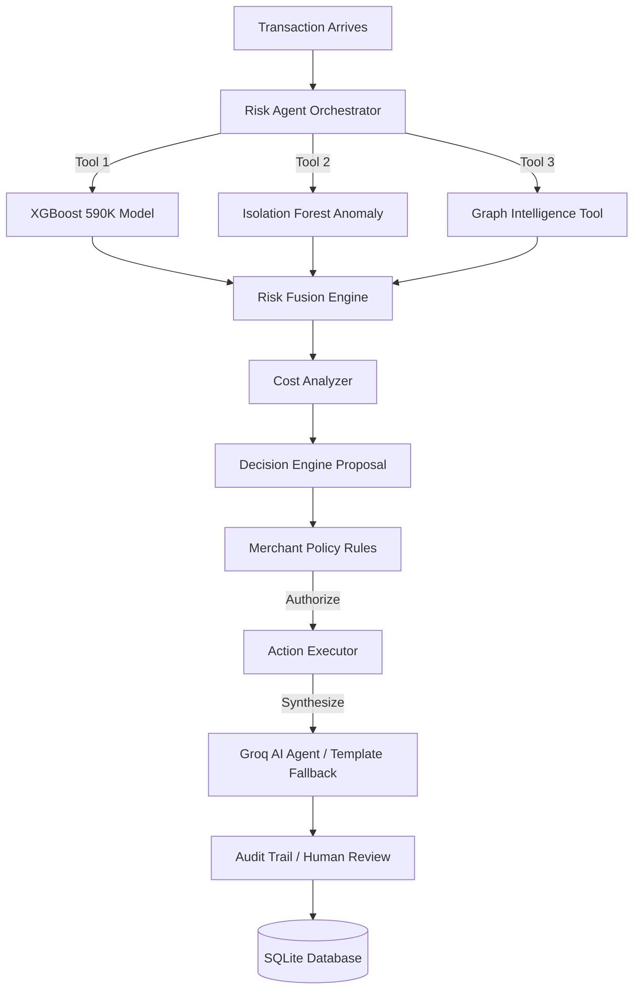

<div align="center">
  
  
  # RazorShield AI Risk Manager 🛡️
  
  **An Autonomous, Explainable AI Risk Manager for Enterprise Scale.**
  
  Traditional fraud systems stop at prediction. RazorShield closes the loop. Built for the Razorpay AI Buildathon.

  [](https://fastapi.tiangolo.com/)
  [](https://groq.com/)
  [](https://xgboost.readthedocs.io/)
  [](https://visjs.org/)

</div>

---

## 🚀 The Vision

RazorShield is a production-grade Agentic AI Risk Orchestrator. It acts as an autonomous risk analyst that doesn't just block or allow transactions based on a static threshold, but investigates them intelligently.

It detects risk, collects evidence across behavioral anomalies and transaction networks, evaluates the cost of intervention vs. fraud loss, overrides decisions using strict merchant policy rules, and finally synthesizes an explainable investigation report using **Groq LLM (llama-3.3-70b)**.

## ✨ Core Features

- **🧠 Agentic Orchestrator:** Drives the investigation using a dynamic state machine with human-in-the-loop escalation.
- **🔬 Multi-Signal ML Tools:** Integrates deterministic models (XGBoost for probability) and unsupervised models (Isolation Forest for behavioral novelty) across 590K records.
- **🌐 Graph Intelligence:** Evaluates transaction networks in real-time, connecting shared devices, emails, and cards.
- **💰 Cost-Aware Reasoning:** Dynamically computes expected financial loss (chargebacks) versus intervention friction (OTP step-ups).
- **📋 Deterministic Fallback:** Highly available rule-based Template Engine guarantees zero downtime if the Groq LLM API is ever unreachable.
- **🎨 Risk Command Center UI:** A stunning, premium frontend featuring glassmorphism aesthetics, live network graphs, dynamic decision gauges, and custom data injection modal.

---

## 🏗️ Architecture



---

## 🛠️ Quick Start

### 1. Environment Setup
Make sure you have python installed. Clone the repository and install the dependencies:
```bash
# Install dependencies
pip install -r requirements.txt
pip install fastapi uvicorn pydantic python-dotenv groq
```

### 2. Configure API Keys
Copy the `.env.example` file into `.env` and paste your Groq API key:
```bash
cp .env.example .env
```
_Ensure `GROQ_API_KEY` is set inside your `.env` file to enable GenAI synthesis._

### 3. Run the Backend
Start the FastAPI service along with the static UI:
```bash
python run.py
```
*(If using a virtual environment: `.venv\Scripts\python run.py`)*

### 4. Open the Command Center
Navigate to your browser:
**➡️ http://localhost:8000/ui/**

---

## 🎯 Using the Dashboard

- **⚡ Simulate Transaction:** Triggers a standard transaction request through the agent.
- **🚨 Simulate Fraud:** Triggers a high-risk anomalous behavior pattern.
- **⚙️ Custom Data:** Opens the modal to inject **your own Custom Transaction details** and see exactly how the ML Fusion Engine and Groq AI analyst respond!

---

## 📊 ML Metrics (Hold-out Test 88K samples)
- **XGBoost ROC-AUC:** `0.9017`
- **Fusion ROC-AUC:** `0.8972` (Weighted ensemble with Isolation Forest)
- **Groq LLM Latency:** ~`800ms` per reasoning cycle.

---
<div align="center">
  <i>Built with ❤️ for the Razorpay AI Buildathon 2026.</i>
</div>