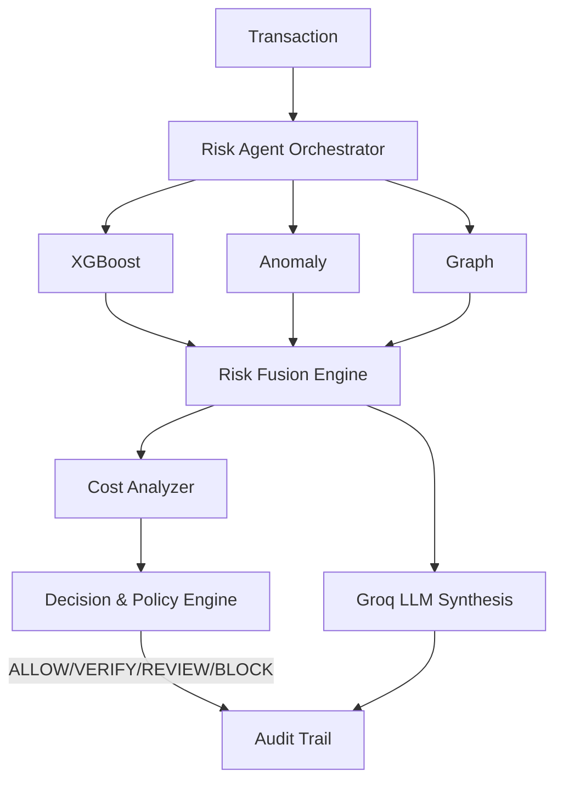

# 🛡️ RazorShield AI Risk Manager

<div align="center">
  <b>Autonomous, Explainable, Cost-Aware AI Risk Management for Digital Payments</b><br>
  <i>Built for the Razorpay AI Buildathon 2026</i><br><br>
  
  [](https://fastapi.tiangolo.com/)
  [](https://groq.com/)
  [](https://xgboost.readthedocs.io/)
</div>

---

## 🚀 The Vision

Traditional fraud systems stop at prediction. **RazorShield closes the loop.**
It is an autonomous risk analyst that detects threats, collects behavioral/network evidence, evaluates the financial cost of intervention, applies merchant policies, and synthesizes explainable reports using **Groq LLM**.

---

## 🏗️ Architecture



---

## 🔬 Dataset & Feature Engineering

Trained on the **IEEE-CIS Fraud Detection** dataset (~590K transactions). Models learn *behavioral context* rather than just transaction contents:
- **Temporal Gaps:** Elapsed time from the last transaction.
- **Velocity & Variance:** Current amount relative to historical average.
- **Identity Context:** Explicitly handles missing identity signals.

---

## 🧠 Multi-Signal Risk Engine

Rather than a single point of failure, RazorShield orchestrates multiple signals:

1. **XGBoost (Primary Fraud Model):** Tabular ML learning nonlinear risk. **ROC-AUC: 0.9017**
2. **Isolation Forest (Behavioral Novelty):** Detects unusual patterns vs. legitimate traffic. **ROC-AUC: 0.5747**
3. **Graph Intelligence:** Evaluates entity networks (shared devices, emails, cards).
4. **LSTM (Experimental):** Sequence-based detection.

**Risk Fusion:** Evidence is combined (e.g., 70% XGB, 30% Anom) for a final score (Baseline ROC-AUC: 0.8972).

---

## 🤖 Orchestration & Cost-Aware Decisioning

The **Risk Agent** orchestrates tools dynamically. Once evidence is gathered, the **Cost Analyzer** computes expected costs:
- **ALLOW:** Potential fraud loss.
- **VERIFY:** Friction/conversion impact.
- **REVIEW:** Manual ops cost.
- **BLOCK:** Loss of legitimate customer.

**Guardrails:** The AI recommends, but the deterministic **Policy Engine** authorizes the final action.

---

## 🧠 GenAI Synthesis

Uses **Groq LLM (llama-3.3-70b)** to translate structured evidence into operator-facing reports (Avg Latency: ~800ms).

> *"Risk Score is 87. Decision: REVIEW. XGBoost probability is elevated. Amount is 15x above historical average. Device is connected to suspicious cards. REVIEW cost is lower than ALLOW."*

---

## 🚀 Quick Start

```bash
# 1. Clone & Setup
git clone <repository-url> && cd razorshield
python -m venv .venv
source .venv/bin/activate  # Windows: .venv\Scripts\Activate.ps1
pip install -r requirements.txt

# 2. Configure & Run
cp .env.example .env       # Add your GROQ_API_KEY
python run.py              # Starts FastAPI & UI
```
**Open the Command Center:** `http://localhost:8000/ui/`

---

## 🎯 Demo Scenarios
1. **Low Risk:** Low ML scores → **ALLOW**
2. **Ambiguous:** High Anomaly → **VERIFY**
3. **Network Risk:** Suspicious shared device → **REVIEW**
4. **Custom Data:** Inject custom data via the UI to test the Agent!

---
<div align="center"><i>Predict the risk. Investigate the evidence. Choose the safest action.</i></div>
