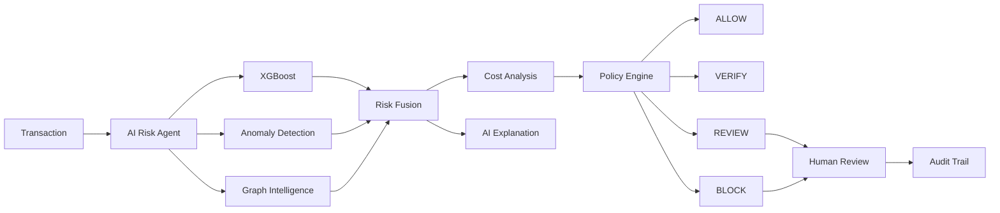

# 🛡️ RazorShield AI Risk Manager

> **An autonomous AI Risk Manager that detects, investigates, and responds to payment risk.**

RazorShield combines **ML fraud detection, behavioral anomaly detection, graph intelligence, cost-aware decisioning, and an AI Risk Agent** to turn a transaction prediction into an actionable risk decision.

Built for the **Razorpay AI Buildathon — AI Risk Manager Track**.

---

## 🚀 How It Works



### Agent Loop

**Detect → Investigate → Reason → Evaluate Cost → Apply Policy → Act → Audit**

---

## 🧠 ML System

### XGBoost — Primary Fraud Model

Trained on the full **590K IEEE-CIS transaction dataset**.

| Metric | Score |
|---|---:|
| ROC-AUC | **0.9017** |
| PR-AUC | **0.5152** |
| Precision | **0.5412** |
| Recall | **0.4535** |
| F1 | **0.4935** |

### Isolation Forest

Detects **behavioral novelty**, rather than replacing the supervised fraud model.

### Graph Intelligence

Connects:

`Transaction → Card → Device → Email → Address`

to detect suspicious entity relationships and shared infrastructure.

### LSTM

Evaluated as a temporal experiment.

Current PR-AUC: **0.0454**

Because it underperformed XGBoost, it is retained as an experimental component rather than forced into the main risk path.

---

## 🤖 AI Risk Agent

RazorShield is not just:

`Transaction → Model → Fraud`

The agent can:

- inspect ML risk signals
- investigate behavioral anomalies
- inspect transaction relationships
- retrieve historical context
- compare intervention costs
- recommend an action
- explain the evidence
- escalate uncertain cases
- record the complete investigation

The GenAI layer is used for **structured risk synthesis and explanation**, while deterministic policies control the final authorized action.

---

## 💰 Cost-Aware Decisioning

Instead of using only a fixed fraud threshold, RazorShield compares:

- **ALLOW** → potential fraud loss
- **VERIFY** → customer friction
- **REVIEW** → operational cost
- **BLOCK** → possible legitimate-customer loss

The system chooses the safest policy-compliant action based on risk and cost.

---

## 🎯 Decisions

```text
LOW       → ALLOW
MEDIUM    → VERIFY
HIGH      → REVIEW
CRITICAL  → BLOCK / REVIEW
```

Thresholds are configurable.

---

## 🌐 Risk Command Center

The dashboard provides:

- transaction risk score
- fraud probability
- anomaly score
- graph/network view
- AI investigation explanation
- cost comparison
- recommended action
- human review queue
- audit trail
- system metrics

---

## 🛠️ Tech Stack

**ML:** Python, XGBoost, scikit-learn, TensorFlow  
**Agent:** Groq / Llama + deterministic tool orchestration  
**Backend:** FastAPI  
**Frontend:** React / web dashboard  
**Database:** SQLite  
**Graph:** Network-based relationship features  
**Deployment:** Docker

---

## 📊 Dataset

**IEEE-CIS Fraud Detection**

```text
Transactions : ~590,540
Identity     : ~144,233
```

The data contains anonymized transaction, card, identity, device, email, address, and behavioral features.

RazorShield uses chronological **70/15/15 train-validation-test splitting** to reduce temporal leakage.

---

## 📁 Project Structure

```
AI_Riskk/
│
├── agent/                          # Agentic Orchestration Layer
│   ├── orchestrator.py             # Core Risk Agent – tool orchestration & state machine
│   ├── decision.py                 # Decision Engine + Merchant Policy enforcement
│   └── llm_reasoner.py             # Groq LLM synthesis + deterministic fallback
│
├── ml/                             # Machine Learning Layer
│   ├── inference.py                # XGBoost & Isolation Forest inference logic
│   ├── fusion.py                   # Risk Fusion Engine (weighted ensemble)
│   ├── model_loader.py             # Loads models at startup (no re-training at runtime)
│   └── graph/
│       ├── graph_features.py       # Entity network feature computation
│       └── graph_risk_tool.py      # Graph risk scoring tool for the agent
│
├── models/                         # Saved Model Artifacts
│   ├── razorshield_xgboost_v2.pkl
│   ├── razorshield_xgboost_v2_features.pkl
│   ├── razorshield_isolation_forest_590k.pkl
│   ├── razorshield_lstm_590k.keras
│   └── ...                         # Scalers, feature lists, thresholds
│
├── Backend/                        # FastAPI Service Layer
│   ├── app/
│   │   ├── main.py                 # API routes, startup, static file serving
│   │   └── db/                     # SQLite Audit Database
│   └── razorshield.db
│
├── frontend/                       # Risk Command Center UI
│   ├── index.html                  # Dashboard layout
│   ├── style.css                   # Glassmorphism design system
│   └── app.js                      # Live simulation, graph rendering, custom data modal
│
├── Notebooks/                      # ML Research & Training Notebooks
│   ├── Data_Understanding.ipynb
│   ├── Preprocess.ipynb
│   ├── XGBoost.ipynb
│   ├── 03_Model.ipynb
│   ├── 05_anomaly.ipynb
│   └── lstm.ipynb
│
├── run.py                          # Single command to start the backend server
├── requirements.txt
├── .env.example                    # API key template (copy to .env)
├── Dockerfile
└── README.md
```

---

## 🚀 Quick Start

```bash
git clone <repo>
cd razorshield

python -m venv .venv
.venv\Scripts\activate

pip install -r requirements.txt

python run.py
```

Open:

```text
http://localhost:8000/ui/
```

---

## 🏆 Why RazorShield?

Traditional systems often stop at:

> **"This transaction looks risky."**

RazorShield continues:

> **"Here is the evidence, here is the network context, here is the expected cost, here is the safest action, and here is the audit trail explaining why."**

---

## ⚠️ Limitations

RazorShield is a **production-oriented prototype**, not a guaranteed fraud-prevention system.

Current limitations include:

- incomplete identity coverage
- imperfect fraud recall
- experimental graph component
- LSTM currently underperforms XGBoost
- synthetic/demo actions rather than unrestricted financial execution

---

## 🔮 Future Work

- stronger temporal models
- calibrated risk probabilities
- online feature stores
- graph neural networks
- drift monitoring
- merchant-specific policies
- offline feedback-driven retraining

---

<div align="center">

### 🛡️ RazorShield

**Detect. Investigate. Reason. Decide. Audit.**

</div>
