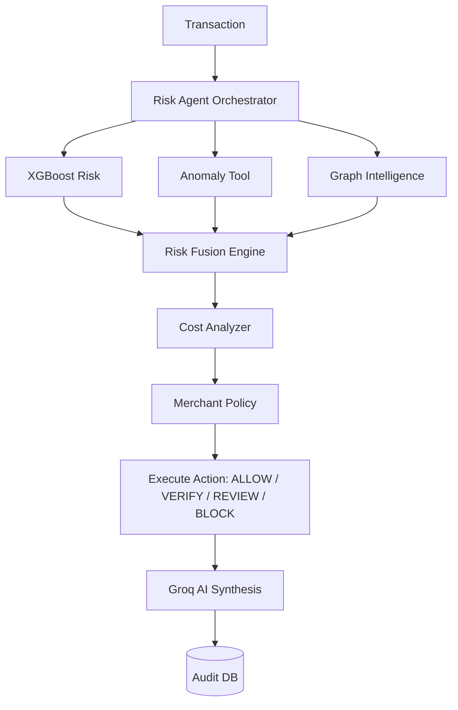

# 🛡️ RazorShield AI Risk Manager

<div align="center">
  <b>Autonomous, Explainable, Cost-Aware AI Risk Management for Digital Payments</b><br>
  <i>Built for the Razorpay AI Buildathon 2026</i><br><br>
  
  [](https://fastapi.tiangolo.com/)
  [](https://groq.com/)
  [](https://xgboost.readthedocs.io/)
</div>

---

## 🚀 The Vision

Traditional fraud systems stop at prediction (`Transaction → Model → Fraud / Not Fraud`). **RazorShield closes the loop.**

It acts as an autonomous risk analyst that investigates transactions intelligently. It detects risk, collects evidence across behavioral anomalies and transaction networks, evaluates the cost of intervention, overrides decisions using strict policy rules, and synthesizes an explainable investigation report using **Groq LLM**.

---

## 🧠 Core Features

- **🤖 Agentic Orchestrator:** Drives the investigation using a dynamic state machine and orchestrates multiple ML tools.
- **🔬 Multi-Signal ML Engine:** Integrates deterministic **XGBoost** (ROC-AUC: 0.9017) for probability and unsupervised **Isolation Forest** for behavioral novelty.
- **🌐 Graph Intelligence:** Evaluates transaction networks in real-time (shared devices, emails, cards).
- **💰 Cost-Aware Reasoning:** Dynamically computes expected financial loss (chargebacks) versus intervention friction (OTP step-ups) to select the optimal action (ALLOW, VERIFY, REVIEW, BLOCK).
- **📋 Deterministic Fallback:** Highly available rule-based Template Engine guarantees zero downtime if the Groq LLM API is ever unreachable.
- **🎨 Risk Command Center UI:** A stunning, premium frontend featuring live network graphs, dynamic decision gauges, and a custom data injection modal.

---

## 🏗️ Architecture Flow



---

## 📊 Dataset & Metrics

Trained on the **IEEE-CIS Fraud Detection** dataset (~590K transactions), focusing heavily on behavioral feature engineering (time gaps, velocity, magnitude changes).

| Metric | XGBoost (Primary) | Isolation Forest (Novelty) | LSTM (Experimental) |
|---|---|---|---|
| **ROC-AUC** | **0.9017** | 0.5747 | 0.5619 |
| **PR-AUC** | **0.5152** | 0.0336 | 0.0454 |
| **Role** | Fraud Probability | Behavioral Anomaly | Sequence Detection |

*(Fusion Baseline ROC-AUC: 0.8972)*

---

## 🛠️ Quick Start

### 1. Environment Setup
```bash
git clone <repository-url>
cd razorshield
python -m venv .venv
# Activate venv: .venv\Scripts\Activate.ps1 (Windows) or source .venv/bin/activate (Mac/Linux)
pip install -r requirements.txt
```

### 2. Configure API Keys
```bash
cp .env.example .env
```
*Ensure `GROQ_API_KEY` is set inside your `.env` file to enable GenAI synthesis.*

### 3. Run the Backend & UI
```bash
python run.py
# Or: uvicorn backend.app.main:app --reload
```

### 4. Open the Command Center
Navigate to your browser: **➡️ http://localhost:8000/ui/**

---

## 🎯 Demoing the Dashboard

- **⚡ Simulate Transaction:** Triggers a standard, likely safe transaction request.
- **🚨 Simulate Fraud:** Triggers a high-risk anomalous behavior pattern.
- **⚙️ Custom Data:** Inject your own custom transaction details and see exactly how the ML Fusion Engine and Groq AI analyst respond in real-time.

---

<div align="center">
  <i>Detect → Investigate → Reason → Decide → Act → Audit</i><br>
  <b>Built with ❤️ for the Razorpay AI Buildathon 2026.</b>
</div>
