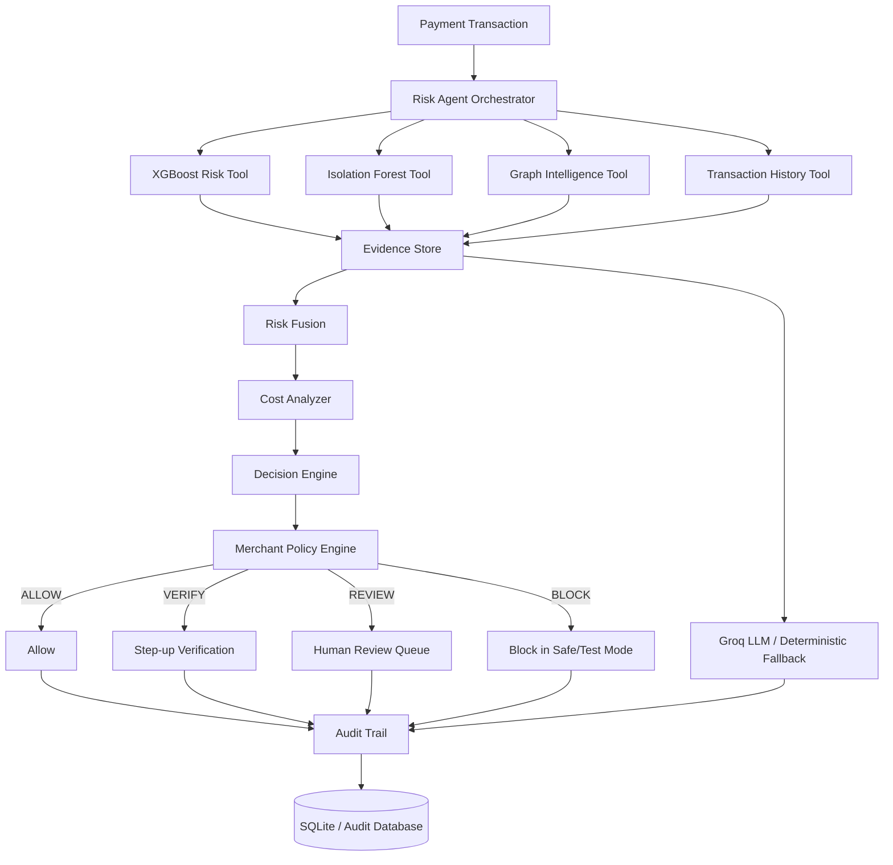

# 🛡️ RazorShield AI Risk Manager

<div align="center">
  <b>Autonomous, Explainable, Cost-Aware AI Risk Management for Digital Payments</b><br>
  <i>Built for the Razorpay AI Buildathon 2026</i><br><br>
  
  [](https://fastapi.tiangolo.com/)
  [](https://groq.com/)
  [](https://xgboost.readthedocs.io/)
</div>

---

## 🚀 The Vision

Traditional fraud systems stop at prediction (`Transaction → Model → Fraud / Not Fraud`). **RazorShield closes the loop.**

It acts as an autonomous risk analyst that detects risk, collects evidence across behavioral anomalies and transaction networks, evaluates the cost of intervention, overrides decisions using strict policy rules, and synthesizes an explainable investigation report using **Groq LLM**.

---

## 🏗️ End-to-End Architecture



---

## 🔬 Dataset & Feature Engineering

RazorShield uses the **IEEE-CIS Fraud Detection** dataset (~590,540 transactions). Since fraud is a minority class, the system evaluates using **ROC-AUC, PR-AUC, F1, and business cost** rather than naive accuracy.

**Chronological Split:**
- 70% Train (~413K) | 15% Validation (~88K) | 15% Test (~88K)
- Splits are strictly chronological (`TransactionDT`) to prevent future data leakage.

**Behavioral Feature Engineering:**
Instead of just transaction contents, models learn behavioral context:
- `time_since_previous`: Elapsed time from the last transaction.
- `amount_vs_card_avg`: Current amount relative to historical behavior (e.g., 20x higher than usual).
- `recent_card_transactions`: Transaction velocity.
- `has_identity`: Accounts for missing identity context explicitly.

---

## 🧠 Multi-Signal Risk Engine

RazorShield relies on multiple ML signals rather than a single point of failure.

### 1. XGBoost (Primary Fraud Model)
High-dimensional tabular fraud detection learning nonlinear relationships across features.
- **ROC-AUC:** `0.9017`
- **PR-AUC:** `0.5152`

### 2. Isolation Forest (Behavioral Novelty)
Answers: *"Does this transaction look unusual compared with legitimate patterns?"*
- **ROC-AUC:** `0.5747` (Treated as a secondary novelty signal)

### 3. Graph Intelligence
Evaluates entity networks (e.g., Device-A shared by Card-1 and Card-2). Features include connected entity count, shared devices/emails, and network degree.

### 4. LSTM (Experimental Temporal Model)
Evaluates sequential transaction behavior. Current ROC-AUC is `0.5619`. Deliberately kept experimental as it does not yet outperform XGBoost.

**Risk Fusion:**
Evidence streams are combined (e.g., 70% XGBoost, 30% Anomaly) into a final risk score (0-100). The current fusion ROC-AUC baseline is `0.8972`.

---

## 🤖 Agentic Orchestration & Cost-Aware Decisioning

The **Risk Agent** receives a transaction and orchestrates the ML tools based on dynamic need, ensuring low-risk cases terminate early and ambiguous cases trigger deep investigation.

Once evidence is gathered, the **Cost Analyzer** computes the expected action cost:
- **ALLOW:** Potential fraud / chargeback loss.
- **VERIFY:** Customer friction, conversion impact.
- **REVIEW:** Manual operations cost.
- **BLOCK:** Potential loss of legitimate customer.

**Policy Guardrails:** The agent recommends, but the policy engine authorizes. If a transaction violates a merchant rule, it overrides the AI (e.g., AI says ALLOW, but Policy forces REVIEW).

---

## 🧠 GenAI Synthesis & Explainability

Uses **Groq LLM (llama-3.3-70b)** for natural-language risk synthesis. The LLM receives structured evidence and creates an operator-facing report (Avg Latency: ~800ms).

Example Explanation:
> *"Risk Score is 87. Decision: REVIEW. XGBoost fraud probability is elevated. Transaction amount is 15x above historical card behavior. Device is connected to multiple suspicious cards. Expected cost of REVIEW is lower than ALLOW."*

*(A deterministic template fallback guarantees zero downtime).*

---

## 🖥️ Backend & Operations Command Center

**Backend:** FastAPI service with strict route separation (`/predict`, `/investigate`, `/decide`, `/execute`). Models are loaded once at startup.

**Frontend Command Center:** A visually stunning risk-ops dashboard for tracking:
- Screened volume, fraud detected, review rates.
- Agent investigation traces and network graphs (identities masked).
- Custom transaction simulation via the **Custom Data Modal**.

---

## 🚀 Quick Start

### 1. Environment Setup
```bash
git clone <repository-url>
cd razorshield
python -m venv .venv
# Activate venv: .venv\Scripts\Activate.ps1 (Windows) or source .venv/bin/activate (Linux/macOS)
pip install -r requirements.txt
```

### 2. Configure API Keys
```bash
cp .env.example .env
```
*(Ensure `GROQ_API_KEY` is set inside your `.env` file to enable GenAI synthesis).*

### 3. Run the Backend & UI
```bash
python run.py
# Or: uvicorn backend.app.main:app --reload
```

### 4. Open the Command Center
Navigate to your browser: **➡️ http://localhost:8000/ui/**

---

## 🎯 Demo Scenarios
1. **Low Risk:** Low ML scores, normal history → **ALLOW**
2. **Ambiguous:** Moderate XGBoost, High Anomaly → **VERIFY**
3. **Network Risk:** Moderate scores but suspicious shared device → **REVIEW**
4. **Critical:** High fraud probability, high loss expected → **BLOCK / REVIEW**
5. **Custom Data:** Inject manual data via the UI to test the Agent!

---

<div align="center">
  <i>Predict the risk. Investigate the evidence. Choose the safest action.</i>
</div>
